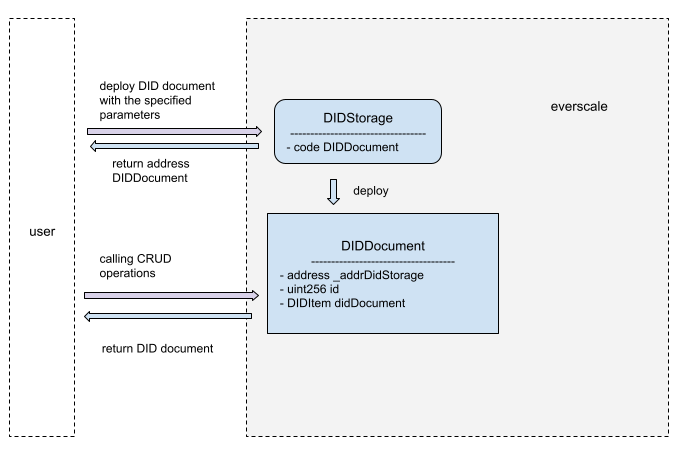

# Documentation on Radiance Team DID

## Key terms

**Decentralized identifier (DID)** – A globally unique persistent identifier that does not require a centralized registration authority and is often generated and/or registered cryptographically.

**DID controller** – An entity that has the capability to make changes to a DID document. A DID might have more than one DID controller.

**DID document** – A collection of data describing a DID subject, including mechanisms such as cryptographic public keys that can be used to authenticate oneself and validate one's association with the DID.

**DID method** – The DID method is defined by the DID method specification, which specifies the exact operations by which DIDs and DIDs are created, resolved, updated, and deactivated document.

**DID subject** – The object identified by the DID and described by the DID document. The DID subject can be anything: a person, a group, an organization, a physical thing, a digital thing, a logical thing, etc.

**Verifiable data registry** – A system that makes it easy to create, check, update and / or deactivate DID and DID document.

## Annotation

Decentralized identifiers are a new type of identifier that uses cryptography to validate data without third parties. DIDs were created to be decoupled from centralized registries, identity providers, and certification authorities. Each DID link with DID document describing the DID subject to which the DID belongs.

Our system uses the DID method, represented in the form of Everscale smart contracts, which store information in DID document. The DID method is called as «everscale". 

## DID syntax

DID Scheme is an RFC3986-compliant URI Scheme.

The DID URI has 3 parts: 
1)	URI scheme ("did:")
2)	An identifier for the DID method ("everscale:")
3)	The unique DID method of a specific identifier

Our Everscale DID method meets the requirements outlined in did-core section 8.1. DIDs that use our method must start with the prefix: did: everscale. The rest after the prefix is   the identifier of the particular method, which is represented as a pubkey Everscale contract. Pubkey Everscale contract belongs to the DID subject which describes the DID document stored under this DID.

**Example**: did:everscale:28f5254ada3193904d65d0ab4d60a05d8ae51f03a2d4cf7d4352030996188580

## The general scheme of relations

## CRUD operations

The DIDStorage smart contract serves as an interface for generating DIDs and searching for DID documents by pubkey. All actions for reading, changing and deactivating a DID take place in the DIDDocument smart contract, which is created for each DID and DIDDocument.

The specification of all contract functions: [docs/specification.md](./specification.md)

### Create

Everscale DID can be created directly if you know the address of the DIDStorage contract or using our SDK.

The DID Document is created by deploying the DIDDocument contract and calling the init function, which must be signed with the secret key of the owner of the pubkey specified when the DIDDocument was created. 
To create the DID and DIDDocument, you must call the addDid method in DIDStorage with the correct parameters. And then calling init from DIDDocument.

### Read

Reading can be divided in 2 contract using the resolveDidDocument function in the DIDStorage contract which will return the address of the DIDDocument contract.

The second part is to read the DID Document using the getDid function in the DIDDocument contract.

### Refresh

here are 2 functions to update DID Document which available only for DID controller.
newDIDDocument updates the DID Document 
newDidIssuerAddr updates the DID controller address

### Deactivate and remove

Methods available only for DID controller.
newDidStatus updates status DID Document
deleteDidDocument completely deletes DID and DID Document
